# Inquiro

<div align="center">
  <h1>🔬 Inquiro</h1>
  <p><strong>AI-Powered Document Research Assistant</strong></p>
  <p><em>Transform your documents into an intelligent knowledge base with local RAG technology</em></p>
  
  [](https://www.python.org/downloads/)
  [](https://opensource.org/licenses/MIT)
  [](https://langchain.com/)
  [](https://ollama.ai/)
</div>

---

## 🎯 Overview

**Inquiro** is a professional-grade Retrieval-Augmented Generation (RAG) system that transforms your document collections into an intelligent, queryable knowledge base. Built for researchers, analysts, and knowledge workers who need precise, source-attributed answers from their documents.

Unlike generic AI assistants, Inquiro grounds every response in your specific documents, ensuring accuracy, relevance, and complete traceability of information sources.

## ✨ Key Features

### 🎯 **Precision & Accuracy**
- **Document-Grounded Responses**: Every answer is based on your specific documents, not generic training data
- **Source Attribution**: Complete traceability with exact document and page references
- **Context-Aware**: Understands document relationships and maintains coherent reasoning

### 🚀 **Professional Performance**
- **High-Quality Embeddings**: Uses Nomic's state-of-the-art embedding models for semantic understanding
- **Efficient Vector Search**: FAISS-powered similarity search for instant document retrieval
- **Optimized Chunking**: Intelligent text segmentation preserves context and meaning

### 🔒 **Privacy & Control**
- **100% Local Processing**: No data leaves your machine - complete privacy guaranteed
- **Offline Capable**: Works without internet connection once models are downloaded
- **Your Data, Your Control**: Full ownership and control of your knowledge base

### 💻 **User Experience**
- **Multiple Interfaces**: Choose between CLI, TUI, or programmatic API access
- **Cross-Platform**: Works on Windows, macOS, and Linux
- **Easy Setup**: Automated dependency management and model installation

## 🏗️ Architecture

```mermaid
graph TD
    A[📄 PDF & DOCX Documents] --> B[🔄 Document Loader]
    B --> C[✂️ Text Chunking]
    C --> D[🧠 Embedding Generation]
    D --> E[🗄️ FAISS Vector Store]
    
    F[❓ User Query] --> G[🔍 Semantic Search]
    G --> E
    E --> H[📋 Context Retrieval]
    H --> I[🤖 LLM Processing]
    I --> J[✅ Grounded Response]
```



### Core Components

| Component | Technology | Purpose |
|-----------|------------|---------|
| **Document Processing** | PyMuPDF & Unstructured | High-fidelity PDF and DOCX text extraction |
| **Text Chunking** | LangChain RecursiveCharacterTextSplitter | Semantic-aware text segmentation |
| **Embeddings** | Nomic Embed Text | High-quality vector representations |
| **Vector Database** | FAISS | Efficient similarity search |
| **Language Model** | Ollama (Llama 3) | Local response generation |

## 🚀 Quick Start

### Prerequisites

- **Python 3.8+** (Python 3.10+ recommended)
- **8GB+ RAM** (for optimal performance)
- **Ollama** installed and running

### 1. Installation

```bash
# Clone the repository
git clone https://github.com/yourusername/inquiro.git
cd inquiro

# Create virtual environment (recommended)
python -m venv venv
source venv/bin/activate  # On Windows: venv\Scripts\activate

# Install dependencies
pip install -r requirements.txt
```

### 2. Setup Ollama Models

```bash
# Install required models (one-time setup)
ollama pull llama3:8b          # Language model (~4.7GB)
ollama pull nomic-embed-text   # Embedding model (~274MB)

# Verify installation
ollama list
```

### 3. Setup Your Knowledge Base

```bash
# Verify system requirements
python ui/setup_local.py

# Add your documents to the data directory
mkdir data
# Copy your PDF and DOCX files to ./data/

# Build the knowledge base
python core/populate_database.py
```

### 4. Start Querying

Choose your preferred interface:

#### Command Line Interface
```bash
python ui/inquiro_cli.py
```

#### Terminal User Interface (Recommended)
```bash
python ui/inquiro_tui.py
```

#### Direct Query
```bash
python core/query_data.py "What are the main findings in the research papers?"
```

## 💡 Usage Examples

### Research Analysis
```bash
# Analyze multiple research papers
python core/query_data.py "What methodologies were used across the studies?"
```

### Document Comparison
```bash
# Compare findings across documents
python core/query_data.py "How do the conclusions differ between paper A and paper B?"
```

### Fact Extraction
```bash
# Extract specific information
python core/query_data.py "What are the statistical results reported in the studies?"
```

## 🎯 Use Cases

### 📚 **Academic Research**
- Literature review and synthesis
- Cross-paper analysis and comparison
- Methodology extraction and analysis
- Citation and reference tracking

### 🏢 **Business Intelligence**
- Policy document analysis
- Compliance documentation review
- Market research synthesis
- Due diligence document review

### 📖 **Knowledge Management**
- Technical documentation querying
- Standard operating procedure lookup
- Training material synthesis
- Institutional knowledge preservation

### 🎓 **Education**
- Course material analysis
- Curriculum development support
- Student research assistance
- Academic writing support

## 📁 Project Structure

```
inquiro/
├── 📁 core/              # Core RAG functionality
│   ├── config.py         # Configuration management
│   ├── get_embedding.py  # Embedding generation
│   ├── populate_database.py  # Database population
│   └── query_data.py     # Query processing
├── 📁 ui/                # User interfaces
│   ├── inquiro_cli.py    # Command line interface
│   ├── inquiro_tui.py    # Terminal user interface
│   └── setup_local.py    # System verification
├── 📁 tests/             # Test suite
├── 📄 requirements.txt   # Python dependencies
└── 📄 README.md         # This file
```

## 🔧 Configuration

The system uses sensible defaults but can be customized via environment variables or configuration files:

| Setting | Default | Description |
|---------|---------|-------------|
| `DATA_PATH` | `C:/inquiro/data` (Windows) | Document storage location |
| `FAISS_PATH` | `C:/inquiro/database` | Vector database location |
| `CHUNK_SIZE` | `500` | Text chunk size for processing |
| `CHUNK_OVERLAP` | `50` | Overlap between chunks |

## 🧪 Testing

Run the test suite to verify your installation:

```bash
# Run all tests
python -m pytest tests/

# Run specific tests
python -m pytest tests/test_rag.py -v
```

## 🛠️ Development

### Setting up Development Environment

```bash
# Install development dependencies
pip install -r requirements-dev.txt

# Install pre-commit hooks
pre-commit install

# Run linting
black .
flake8 .
```

### Contributing

1. Fork the repository
2. Create a feature branch (`git checkout -b feature/amazing-feature`)
3. Commit your changes (`git commit -m 'Add amazing feature'`)
4. Push to the branch (`git push origin feature/amazing-feature`)
5. Open a Pull Request

See [CONTRIBUTING.md](CONTRIBUTING.md) for detailed guidelines.

## 📚 Documentation

- [**Installation Guide**](docs/installation.md) - Detailed setup instructions
- [**User Manual**](docs/user-guide.md) - Complete usage documentation
- [**API Reference**](docs/api.md) - Programmatic interface documentation
- [**Troubleshooting**](docs/troubleshooting.md) - Common issues and solutions

## 🤝 Support

- **Issues**: [GitHub Issues](https://github.com/yourusername/inquiro/issues)
- **Discussions**: [GitHub Discussions](https://github.com/yourusername/inquiro/discussions)
- **Documentation**: [Project Wiki](https://github.com/yourusername/inquiro/wiki)

## 📄 License

This project is licensed under the MIT License - see the [LICENSE](LICENSE) file for details.

## 🙏 Acknowledgments

- **LangChain**: For the excellent RAG framework
- **Ollama**: For making local LLMs accessible
- **FAISS**: For efficient vector similarity search
- **Nomic**: For high-quality embedding models

---

<div align="center">
  <p>Made with ❤️ for researchers and knowledge workers</p>
  <p>⭐ Star this repo if you find it helpful!</p>
</div>
